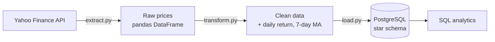

# Stock Data Pipeline

A batch ETL pipeline that extracts daily stock prices from Yahoo Finance, cleans and enriches them with Python, and loads them into a PostgreSQL data warehouse modeled as a **star schema**.

## Architecture



1. **Extract**: downloads daily OHLCV prices and company info (name, sector) for a list of tickers using `yfinance`.
2. **Transform**: removes missing values and duplicates, normalizes dates, computes the daily return and the 7-day moving average per ticker, and builds the date dimension.
3. **Load**: upserts the data into PostgreSQL (dimensions first, then facts). The pipeline is **idempotent**: running it multiple times never creates duplicates.

## Tech stack

| Layer | Tools |
|---|---|
| Language | Python 3.12 |
| Data processing | pandas |
| Data source | yfinance |
| Database | PostgreSQL 16 (Docker) |
| DB access | SQLAlchemy, psycopg2 |
| Config | python-dotenv |

## Data model

Star schema with one fact table and two dimensions. **Grain:** one row = one ticker on one trading day.

```
          dim_date                      dim_ticker
     ┌──────────────┐              ┌──────────────┐
     │ date_key  PK │              │ ticker_key PK│
     │ full_date    │              │ symbol       │
     │ year, month  │              │ company_name │
     │ day          │              │ sector       │
     │ day_of_week  │              └──────┬───────┘
     └──────┬───────┘                     │
            │      fact_daily_prices      │
            │   ┌─────────────────────┐   │
            └──►│ date_key   FK       │◄──┘
                │ ticker_key FK       │
                │ open, high, low     │
                │ close, volume       │
                │ daily_return, ma_7d │
                └─────────────────────┘
```

## Project structure

```
StockDataPipeline/
├── docker-compose.yml      # PostgreSQL container
├── .env.example            # environment variables template
├── requirements.txt
├── src/
│   ├── extract.py          # pulls data from Yahoo Finance
│   ├── transform.py        # cleaning + calculated columns
│   ├── load.py             # upserts into PostgreSQL
│   └── pipeline.py         # runs the full ETL with logging
├── sql/
│   ├── create_tables.sql   # star schema DDL
│   └── example_queries.sql # analytics queries
└── tests/
```

## How to run

**Prerequisites:** Python 3.11+, Docker Desktop.

```bash
# 1. Clone and set up the environment
git clone https://github.com/DavidDiaconescu/stock-data-pipeline.git
cd stock-data-pipeline
python3.12 -m venv .venv
source .venv/bin/activate
pip install -r requirements.txt

# 2. Configure the database credentials
cp .env.example .env        # then set your own password in .env

# 3. Start PostgreSQL and create the tables
docker compose up -d
docker exec -i stock_postgres psql -U stock_user -d stock_db < sql/create_tables.sql

# 4. Run the pipeline
python src/pipeline.py

# 5. Run the example analytics queries
docker exec -i stock_postgres psql -U stock_user -d stock_db < sql/example_queries.sql
```

## Example output

Total return per ticker over the loaded period:

```
 symbol | first_close | last_close | total_return_pct
--------+-------------+------------+------------------
 MSFT   |    386.7400 |   528.2650 |            36.59
 NVDA   |    195.5500 |   237.4800 |            21.44
 AAPL   |    312.6600 |   334.9600 |             7.13
 GOOGL  |    366.4600 |   345.1200 |            -5.82
 TSLA   |    419.7700 |   374.2482 |           -10.84
```

The analytics queries use joins on the star schema, CTEs and window functions (`ROW_NUMBER() OVER (PARTITION BY ...)`).

## Design decisions

- **Star schema** instead of a single flat table: analytical queries stay simple and descriptive data (company name, sector) is stored only once.
- **Idempotent loads** with `INSERT ... ON CONFLICT DO UPDATE`: safe to re-run, and a partial intraday price is overwritten by the final close on the next run.
- **Credentials in `.env`**, never committed to Git.

## Roadmap

- [ ] Unit tests for the transformation logic (pytest)
- [ ] Skip the current day while the US market is still open
- [ ] Daily scheduling with Apache Airflow
- [ ] Move transformations to dbt models with data quality tests
- [ ] Streamlit dashboard
- [ ] CI with GitHub Actions